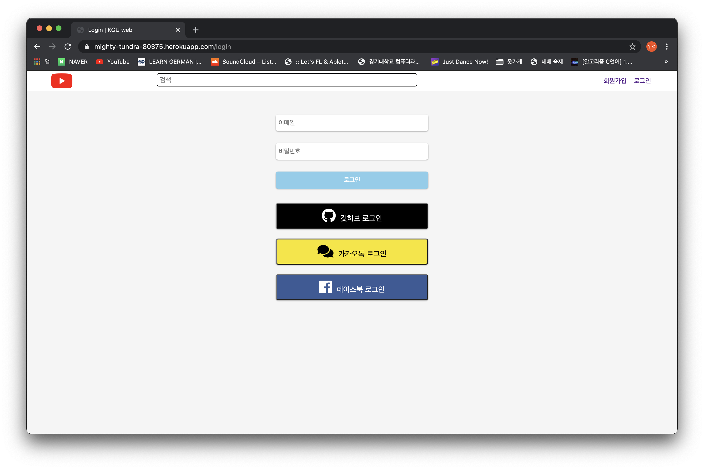

# wotube

## 프로젝트 소개

노마드 코더에서 진행하는 유튜브 클론 프로젝트로 포트폴리오 및 웹개발 능력을 올리기위해 제작했습니다. 로그인과 동영상 업로드, 댓글 작성등을 할 수 있으며 [실제페이지](https://mighty-tundra-80375.herokuapp.com)에서 동작을 확인할 수 있습니다.

 

## 웹페이지 소개

|                       홈                       |                    로그인                     |
| :--------------------------------------------: | :---------------------------------------------: |
|  |  |

|                     비디오 상세                     |                      마이 페이지                       |
| :----------------------------------------------------: | :---------------------------------------------: |
|  |  |

|                     비디오 삭제                     |                      업로드                       |
| :----------------------------------------------------: | :---------------------------------------------: |
|  |  |

 

## 사용한 기술 및 프로그램들
|마크업|스타일링|백엔드|모듈번들러|
|:----:|:----:|:----:|:----:|
|  | | |
|**Pug**|**Scss**|**NodeJS**|**Webpack**|

 

|DB|외부 저장소|Oauth|
|:----:|:----:|:----:|
|  | | 
|**MongoDB**|**AWS S3**|**PassPort**|

